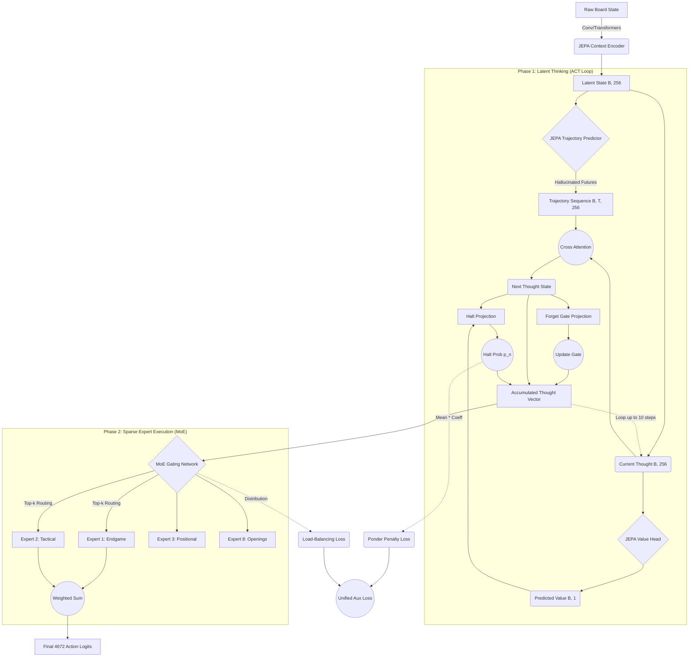

# Guacarpov
A neural network chess engine that learns to play through Joint Embedding Predictive Architecture (JEPA), Latent Thinking (ACT), and Reinforcement Learning via Self-Play.

## Architecture: MoE-Latent Thinking Head

Guacarpov uses a **V-JEPA** style spatiotemporal context encoder connected to a **Latent Thinking Mixture of Experts (MoE)** policy head. 

Instead of relying on explicit Monte Carlo Tree Search (MCTS) which is computationally expensive for mobile devices, the network internalizes its search. It uses an **Adaptive Computation Time (ACT)** loop to mathematically ponder the board state, querying its own predicted value, and allowing it to self-correct thoughts before routing the final strategy to specialized experts for execution.

### Neural Data Flow Diagram

*For a detailed explanation of the architecture, see [doc/moe_latent_thinking_head.md](doc/moe_latent_thinking_head.md).*
